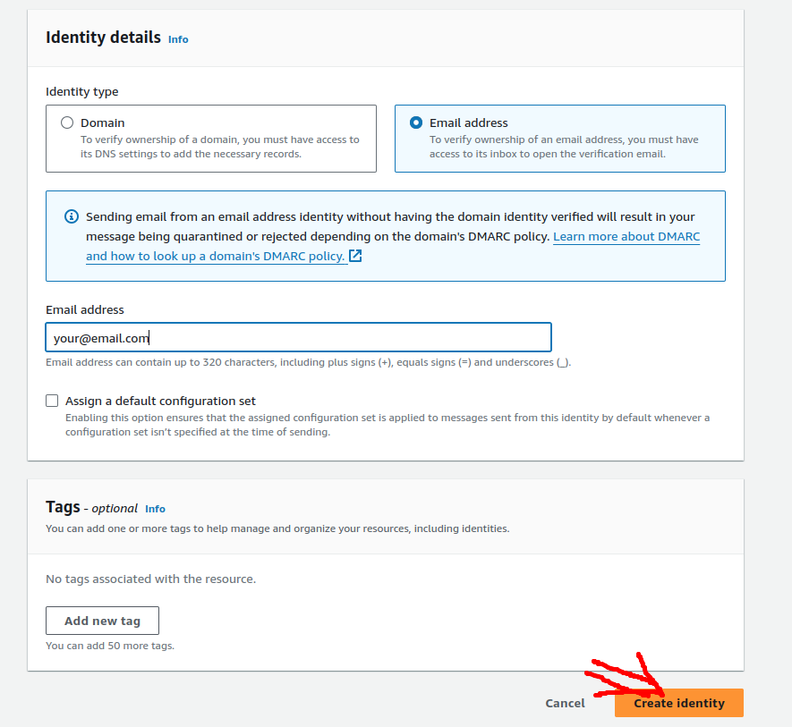

<!-- BEGIN_TF_DOCS -->
# AWS IAM Auto Rotation Terraform Module
Terraform module which creates all necessary resources to rotate all aws IAM user access keys in **a single aws account**. This module is derived from the [official AWS documentation](https://docs.aws.amazon.com/prescriptive-guidance/latest/patterns/automatically-rotate-iam-user-access-keys-at-scale-with-aws-organizations-and-aws-secrets-manager.html) for automatically rotating IAM user access keys at scale with AWS Organizations, however, specifically modified to facilitate use cases for single aws accounts. The module can also provide exceptions for cases where the IAM user keys should not be rotated as well as forcing specific user keys rotation.


## Prerequisite
1. Email template bucket: The bucket name you provide as s3_bucket_name input needs to exist.
2. Amazon Simple Email Service (Amazon SES) moved out of the sandbox:
   1. First you need to create a verified email identity. To do this,
      1. Open aws management console
      2. Go to `SES` (simple email service) in aws console 
      3. Click on `Verified identities` on the left tab and then `create identity` 
      4. Select `Email address` and then write the email address you want to have as verified identity. This email address will be used as `from` of the email. Note that you need to have access to the email address to verify the identity. Click on `Create identity`.
      5. Now you need to verify the email address. To do so, open the email you received from aws and click on verification link  Once you click the verification link, the email identity will be verified and shown like this: 
      6. Now that you have verified one identity, you can request `SES` service to be out of sandbox environment. Unless, SES is out of sandbox environment, you cannot send email to emails addresses which are not verified.
      7. To request `SES` service out of Sanbox environment, go to 
         1. Account dashboard on the left tab
         2. Click on ``view Get set up page`` -> `request production access` 
         3. Fill up the form with relevant details
            1. `Mail type`: 
            
                    transactional
            2. `Website URL`: 
            
                    https://www.yourwebsite.com/
            3. **Use case description**:

                    IAM auto rotation emails
            4. Add additional contact if necessary. 
            5. Acknowledge
            6. Click on `submit request`
         4. Amazon `SES` service should be out of sandbox environment as soon as it is approved by aws. Once you are out of sandbox environment, you can go ahead and send emails from `Amazon SES` service.

## Usage

```hcl

terraform {
  required_providers {
    aws = {
      source = "hashicorp/aws"
      version = ">= 5.0"
    }
  }
}


module "iam-auto-rotation" {
    source              = "git@github.com:pyradd/iam-auto-rotation.git?ref=v1.0.0" ## for https use "github.com/pyradd/iam-auto-rotation.git?ref=v1.0.0"

    s3_bucket_name      = "<S3-BUCKET-NAME>" 
    admin_email_address = "<ADMIN-EMAIL>"
    recipient_emails    = "<LIST-OF-RECIPIENT-EMAILS>"
    ### for a full list of variables, have a look at variables.tf file ###
}
```

## Requirements

| Name | Version |
|------|---------|
| <a name="requirement_terraform"></a> [terraform](#requirement\_terraform) | >= 1.0 |
| <a name="requirement_aws"></a> [aws](#requirement\_aws) | >= 5.0 |

## Providers

| Name | Version |
|------|---------|
| <a name="provider_archive"></a> [archive](#provider\_archive) | 2.4.0 |
| <a name="provider_aws"></a> [aws](#provider\_aws) | 5.24.0 |

## Modules

No modules.

## Resources

| Name | Type |
|------|------|
| [aws_cloudwatch_event_rule.rotation_cloud_watch_event_lambda_trigger](https://registry.terraform.io/providers/hashicorp/aws/latest/docs/resources/cloudwatch_event_rule) | resource |
| [aws_cloudwatch_event_target.lambda](https://registry.terraform.io/providers/hashicorp/aws/latest/docs/resources/cloudwatch_event_target) | resource |
| [aws_iam_group.asaiam_exemptions_group](https://registry.terraform.io/providers/hashicorp/aws/latest/docs/resources/iam_group) | resource |
| [aws_iam_policy.email_template_access](https://registry.terraform.io/providers/hashicorp/aws/latest/docs/resources/iam_policy) | resource |
| [aws_iam_policy.rotation_function_access](https://registry.terraform.io/providers/hashicorp/aws/latest/docs/resources/iam_policy) | resource |
| [aws_iam_role.notifier_function_execution_role](https://registry.terraform.io/providers/hashicorp/aws/latest/docs/resources/iam_role) | resource |
| [aws_iam_role.rotation_lambda_function_execution_role](https://registry.terraform.io/providers/hashicorp/aws/latest/docs/resources/iam_role) | resource |
| [aws_iam_role_policy_attachment.attach_notifier_funtion_policy](https://registry.terraform.io/providers/hashicorp/aws/latest/docs/resources/iam_role_policy_attachment) | resource |
| [aws_iam_role_policy_attachment.attach_rotation_function_policy](https://registry.terraform.io/providers/hashicorp/aws/latest/docs/resources/iam_role_policy_attachment) | resource |
| [aws_iam_role_policy_attachment.managed_policy_1](https://registry.terraform.io/providers/hashicorp/aws/latest/docs/resources/iam_role_policy_attachment) | resource |
| [aws_iam_role_policy_attachment.managed_policy_2](https://registry.terraform.io/providers/hashicorp/aws/latest/docs/resources/iam_role_policy_attachment) | resource |
| [aws_iam_role_policy_attachment.managed_policy_3](https://registry.terraform.io/providers/hashicorp/aws/latest/docs/resources/iam_role_policy_attachment) | resource |
| [aws_iam_role_policy_attachment.managed_policy_4](https://registry.terraform.io/providers/hashicorp/aws/latest/docs/resources/iam_role_policy_attachment) | resource |
| [aws_iam_role_policy_attachment.managed_policy_5](https://registry.terraform.io/providers/hashicorp/aws/latest/docs/resources/iam_role_policy_attachment) | resource |
| [aws_lambda_function.access_key_rotate_lambda_function](https://registry.terraform.io/providers/hashicorp/aws/latest/docs/resources/lambda_function) | resource |
| [aws_lambda_function.notifier_lambda_function](https://registry.terraform.io/providers/hashicorp/aws/latest/docs/resources/lambda_function) | resource |
| [aws_lambda_permission.rotation_cloud_watch_event_lambda_trigger_lambda_permissions](https://registry.terraform.io/providers/hashicorp/aws/latest/docs/resources/lambda_permission) | resource |
| [aws_s3_object.object](https://registry.terraform.io/providers/hashicorp/aws/latest/docs/resources/s3_object) | resource |
| [archive_file.access_key_rotate_lambda_function](https://registry.terraform.io/providers/hashicorp/archive/latest/docs/data-sources/file) | data source |
| [archive_file.notifier_lambda_function](https://registry.terraform.io/providers/hashicorp/archive/latest/docs/data-sources/file) | data source |
| [aws_caller_identity.current](https://registry.terraform.io/providers/hashicorp/aws/latest/docs/data-sources/caller_identity) | data source |
| [aws_iam_policy.AWSLambdaBasicExecutionRole](https://registry.terraform.io/providers/hashicorp/aws/latest/docs/data-sources/iam_policy) | data source |
| [aws_iam_policy.AmazonEC2FullAccess](https://registry.terraform.io/providers/hashicorp/aws/latest/docs/data-sources/iam_policy) | data source |
| [aws_iam_policy.AmazonSSMFullAccess](https://registry.terraform.io/providers/hashicorp/aws/latest/docs/data-sources/iam_policy) | data source |
| [aws_iam_policy_document.access_key_rotate_lambda_function_attched_policy](https://registry.terraform.io/providers/hashicorp/aws/latest/docs/data-sources/iam_policy_document) | data source |
| [aws_iam_policy_document.notifier_lambda_function_attched_policy](https://registry.terraform.io/providers/hashicorp/aws/latest/docs/data-sources/iam_policy_document) | data source |
| [aws_partition.current](https://registry.terraform.io/providers/hashicorp/aws/latest/docs/data-sources/partition) | data source |
| [aws_region.current](https://registry.terraform.io/providers/hashicorp/aws/latest/docs/data-sources/region) | data source |


## Inputs

| Name | Description | Type | Default | Required |
|------|-------------|------|---------|:--------:|
| <a name="input_admin_email_address"></a> [admin\_email\_address](#input\_admin\_email\_address) | Email address that will be used in the 'sent from' section of the email. This needs to be a validated email identity in simple email service | `string` | n/a | yes |
| <a name="input_credential_replication_regions"></a> [credential\_replication\_regions](#input\_credential\_replication\_regions) | Please provide the comma separated regions where you want to replicate the credentials (Secret Manager), e.g. us-east-2,us-west-1,us-west-2 Please skip the region where you are creating stack | `string` | `""` | no |
| <a name="input_dry_run_flag"></a> [dry\_run\_flag](#input\_dry\_run\_flag) | Enables/Disables key rotation functionality. 'True' only sends notifications to end users (Audit Mode). 'False' preforms key rotation and sends notifications to end users (Remediation Mode). | `string` | `"False"` | no |
| <a name="input_email_template_audit"></a> [email\_template\_audit](#input\_email\_template\_audit) | Enter the file name of the email html template to be sent out by the Notifier Module for Audit Mode. Note: Must be located in the 'S3 Bucket Prefix/Template/template\_name.html' folder | `string` | `"iam-auto-key-rotation-enforcement.html"` | no |
| <a name="input_email_template_enforce"></a> [email\_template\_enforce](#input\_email\_template\_enforce) | Enter the file name of the email html template to be sent out by the Notifier Module for Enforce Mode. Note: Must be located in the 'S3 Bucket Prefix/Template/template\_name.html' folder | `string` | `"iam-auto-key-rotation-enforcement.html"` | no |
| <a name="input_execution_role_name"></a> [execution\_role\_name](#input\_execution\_role\_name) | Enter the name of IAM Execution Role that will assume the sub-account role for Lambda Execution. | `string` | `"asa-iam-key-rotation-lambda-execution-role"` | no |
| <a name="input_iam_exemption_group"></a> [iam\_exemption\_group](#input\_iam\_exemption\_group) | Manage IAM Key Rotation exemptions via an IAM Group. Enter the IAM Group name being used to facilitate IAM accounts excluded from auto-key rotation. | `string` | `"IAMKeyRotationExemptionGroup"` | no |
| <a name="input_iam_role_name"></a> [iam\_role\_name](#input\_iam\_role\_name) | Enter the name of IAM Role that the main ASA-iam-key-auto-rotation-and-notifier-solution.yaml CloudFormation template will assume. | `string` | `"asa-iam-key-rotation-lambda-execution-role"` | no |
| <a name="input_inactive_buffer"></a> [inactive\_buffer](#input\_inactive\_buffer) | The grace period between rotation and deactivation of a key. | `string` | `10` | no |
| <a name="input_inactive_period"></a> [inactive\_period](#input\_inactive\_period) | The number of days after which to inactivate keys that had been rotated (Note: This must be greater than RotationPeriod). | `string` | `100` | no |
| <a name="input_recipient_emails"></a> [recipient\_emails](#input\_recipient\_emails) | List of recipient emails | `list(string)` | n/a | yes |
| <a name="input_recovery_grace_period"></a> [recovery\_grace\_period](#input\_recovery\_grace\_period) | Recovery grace period between deactivation and deletion. | `string` | `10` | no |
| <a name="input_resource_owner_tag"></a> [resource\_owner\_tag](#input\_resource\_owner\_tag) | (Optional) Tag key used to indicate the owner of an IAM user resource. | `string` | n/a | yes |
| <a name="input_rotation_period"></a> [rotation\_period](#input\_rotation\_period) | The number of days after which a key should be rotated (rotating from active to inactive). | `string` | `90` | no |
| <a name="input_s3_bucket_name"></a> [s3\_bucket\_name](#input\_s3\_bucket\_name) | S3 Bucket Name where code is located, see the documentation for bucket names https://docs.aws.amazon.com/AmazonS3/latest/userguide/bucketnamingrules.html | `string` | n/a | yes |
| <a name="input_s3_bucket_prefix"></a> [s3\_bucket\_prefix](#input\_s3\_bucket\_prefix) | The prefix or directory where resources will be stored. | `string` | `"asa-iam-rotation"` | no |

## Outputs

No outputs.
<!-- END_TF_DOCS -->